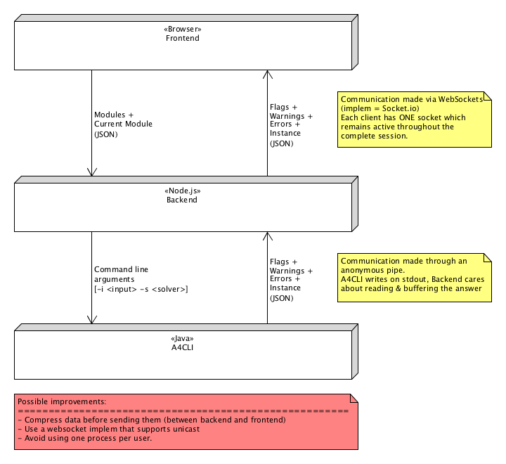

## Architecture of the project
> Side node about all diagrams: 
> All diagrams that are provided as documentation have been drawn with Umlet (www.umlet.com)
> So the 'source' of these diagrams are the *.uxf files.
> In case you just was a version of the diagram that can be better zommed, you can simply check
> the documentation/Diagram folders, they've also been exported to svg.

## Architecture of the fontend-model

## Organization of the User Interface code.
